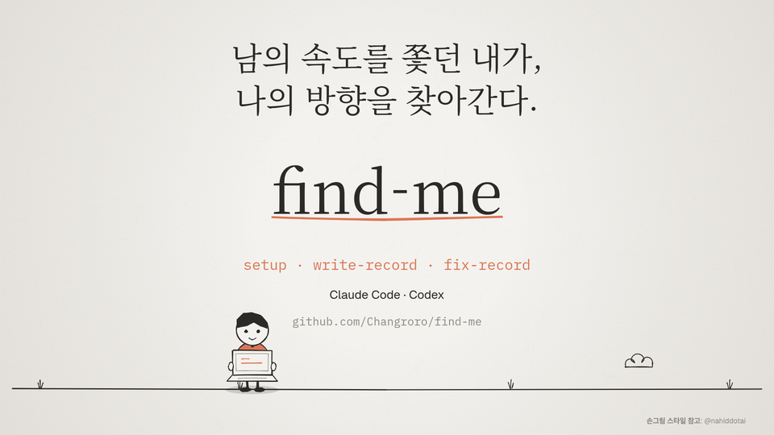

# Find Me

대화에서 자신도 몰랐던 습관·가치관·일하는 방식을 발견해 기록한다. Claude Code와 Codex에서 같은 사용자 JSON과 기록 문서를 사용한다.

기본 기록은 **범용적인 발견 → 실제 대화 맥락** 순서다. 프로젝트명이나 기술명은 근거인 뒤쪽 맥락에 둔다. 직접 말한 사실과 관찰을 구분하고 한 번의 발언을 고정된 성격으로 단정하지 않는다.

```markdown
- #가치관 기록을 쌓는 것 자체보다 자신을 이해하는 데 도움이 되는지를 중요하게 여긴다. 대화 맥락: find-me 기록이 프로젝트 이름 나열에 머물러 쓸모가 적다고 느꼈으며, 습관·가치관·대화 스타일을 발견하고 싶다고 설명했다.
```

## 설치

Python 3.11 이상과 [uv](https://docs.astral.sh/uv/)가 필요하다. 기록은 로컬 Markdown 파일에 저장하므로 Obsidian 계정이나 API 키는 필요 없다.

Claude Code:

```text
/plugin marketplace add Changroro/find-me
/plugin install find-me@find-me
/find-me:setup
```

Codex:

```sh
codex plugin marketplace add Changroro/find-me
codex plugin add find-me@find-me
```

새 세션에서 `$find-me:setup`으로 초기 설정을 요청한다. 플러그인 설치 후에는 새 세션에서 사용한다.

## 사용

| 스킬 | Claude Code | Codex |
|---|---|---|
| setup | `/find-me:setup` | `$find-me:setup` |
| write-record | `/find-me:write-record` | `$find-me:write-record` |
| fix-record | `/find-me:fix-record` | `$find-me:fix-record` |

write-record는 관련 자기 이야기가 나올 때 에이전트가 자동으로 사용할 수도 있다. setup과 fix-record는 사용자 요청으로 실행한다.

setup에서 기록 문서의 절대 경로와 주제를 입력한다. 기본 주제는 습관·성격·가치관·감정·고민·관계·경험·성과·일하는방식·취향이며 선택하거나 추가할 수 있다. 에이전트 사용·개발 습관과 대화 스타일도 이 주제 안에서 기록한다. 기존 기록 문서를 선택하면 이후 내용만 날짜별로 추가한다.

fix-record에는 “발견은 한 문장으로 줄여줘”, “대화 맥락에 내가 한 요구를 더 구체적으로 적어줘”처럼 피드백을 전달한다. 에이전트는 기존 개인 규칙을 보존하면서 프롬프트를 수정하고 전후 예시를 보여 준다. 이후 write-record는 수정된 프롬프트로 동작한다. 과거 기록은 자동으로 고치지 않는다.

## 기록 기준

기록할 만한 내용이 없으면 아무것도 저장하지 않는다. 단순 작업 지시·기술적 요구·한 번의 도구 선택·설정 피드백만으로 성향을 만들지 않는다. 의미 있는 직접 자기 이야기나 충분한 근거가 필요하며, 관찰만으로 습관·성격을 말하려면 독립된 상황 둘 이상의 근거를 확인한다.

날짜에 관계없이 관련 과거 발견과 맥락을 비교한다. 기존 내용의 반복이고 새로운 이유·적용 조건·변화가 없으면 생략한다. 한 발견을 여러 주제의 항목으로 쪼개지 않는다. 완전히 같은 기록의 재추가는 도우미도 차단한다.

모순이나 잘못된 기록이 의심되면 과거 내용과 이번 발언을 보여 주고 사용자에게 묻는다. 선호가 바뀌었는지, 이번 상황만 다른지, 과거 기록이 틀렸는지 답변을 받은 뒤 확인된 범위만 저장한다. 기다리는 동안 해당 기록은 쓰지 않고 다른 작업은 계속할 수 있다. 선별·과거 비교·확인 절차는 개인 프롬프트의 표현·형식 설정과 별개다.

저장 직전에 과거 기록이 달라졌으면 다시 읽고 비교한다. 설정 업데이트만으로 기존 개인 프롬프트나 과거 기록을 덮어쓰지 않는다.

## 개인 설정

배포되는 [assets/default.json](assets/default.json)은 Git으로 관리하는 기본 템플릿이다. setup은 그 프롬프트를 `~/.config/find-me/config.json`에 복사하고 저장 경로·선택 주제를 설정한다.

```json
{
  "record_path": "/절대/경로/기록.md",
  "topics": ["습관", "가치관", "일하는방식"],
  "prompt": "사용자가 조정하는 기록용 프롬프트"
}
```

사용자 JSON은 플러그인 루트 밖에 저장해 Git과 설치 업데이트에서 제외한다. 다른 위치를 쓰려면 두 도구를 실행하는 환경에 동일한 `FIND_ME_CONFIG` 절대 경로를 지정한다. 다른 PC에서는 그 PC의 기록 경로로 setup을 진행한다.

setup 재실행은 기존 JSON을 덮어쓰지 않는다. fix-record는 사용자 JSON의 `prompt`만 바꾼다. 저장 경로나 주제를 나중에 변경하려면 사용자 JSON의 해당 필드를 직접 수정한다. 배포 기본 프롬프트가 업데이트되어도 기존 개인 프롬프트는 그대로 유지된다.

설정이 없거나 JSON·경로·주제가 잘못되면 기록을 중단하고 오류를 알린다. 기본값이나 다른 볼트로 대체하지 않는다. 파일을 쓰는 동안 잠금이 남아 있으면 오류를 알리며, 비정상 종료 뒤에는 다른 작업이 없는지 확인한 후 메시지에 나온 잠금 디렉터리를 정리한다.

## 소개 영상

[](https://github.com/Changroro/find-me/releases/download/v2.1.0/Find-Me-KO.mp4)

노트북을 든 개발자가 AI 포모로 지쳐 있다가 대화에서 자신의 습관과 기준을 발견하며 성장하는 30초 한국어 손그림 영상이다. 위 미리보기를 누르거나 [MP4 동영상 보기·다운로드](https://github.com/Changroro/find-me/releases/download/v2.1.0/Find-Me-KO.mp4)로 완성 영상을 받을 수 있다. [영상 소스와 근거](media/find-me-video/RESEARCH.md)도 포함한다. MP4는 공개 릴리스에 보관하고 폰트는 렌더링 때 준비한다.

## 개발·검증

별도 Git worktree에서 개발한다. 외부 서비스 호출 없이 Python 표준 라이브러리로 설정을 복사·검증·갱신하고 기록을 추가한다.

```sh
uv run python -m unittest discover -s tests
claude plugin validate --strict .
claude plugin validate --strict .claude-plugin/plugin.json
claude plugin validate --strict skills
```

공통 스킬은 `skills/`, Claude Code manifest는 `.claude-plugin/plugin.json`, Codex의 Agent Plugins manifest는 루트 `plugin.json`에 있다. 각 도구의 marketplace도 저장소에 포함한다.

## 라이선스

MIT — [LICENSE](LICENSE).
